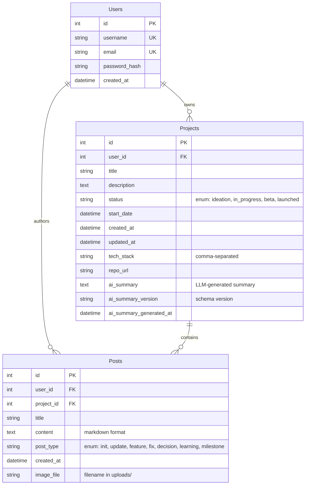

# OpenBuild - Flask Backend with Production AI Integration

<div align="center">

**A production-ready Flask backend demonstrating AI/LLM integration patterns, RESTful API design, and relational database architecture**

[](https://python.org)
[](https://flask.palletsprojects.com/)
[](https://www.sqlalchemy.org/)
[](https://ollama.ai/)
[](LICENSE)

</div>

---

## 🎯 Project Overview

OpenBuild is a **developer portfolio platform** that allows users to document their project journeys through timeline-based updates. The platform demonstrates **production-grade backend engineering** with integrated AI capabilities for automated project summarization.

**What makes this project stand out:**

- Production AI integration with proper error handling and fallback strategies
- Modular Flask architecture using application factory pattern
- Engineered data pipeline: Relational DB → Structured JSON → LLM prompt → Validated response
- Complete backend implementation with authentication, authorization, and data management

**Built to showcase:** Backend development skills, AI integration understanding, production reliability patterns, and full-stack thinking.

---

## ✨ Key Features

### Backend Architecture

- ✅ **Flask Application Factory Pattern** - Modular, testable application structure
- ✅ **Blueprint-Based Routing** - Separated concerns across auth, projects, posts, and home modules
- ✅ **SQLAlchemy ORM** - Normalized 3-table schema with proper relationships
- ✅ **Database Migrations** - Version-controlled schema changes with Flask-Migrate (Alembic)
- ✅ **RESTful API Design** - 14 endpoints across 4 blueprints

### Authentication & Security

- ✅ **Session-Based Authentication** - Flask-Login with user session management
- ✅ **Password Security** - Bcrypt hashing with salt
- ✅ **CSRF Protection** - Flask-WTF token validation on all forms
- ✅ **Authorization Checks** - User-owned resource verification
- ✅ **SQL Injection Prevention** - Parameterized queries via SQLAlchemy

### AI Integration (The Differentiator)

- ✅ **Production Reliability Patterns** - Timeout handling, fallback logic, response validation
- ✅ **Data Export Pipeline** - Structured JSON serialization from relational database
- ✅ **Engineered Prompts** - Context-aware, factual prompt templates (not generic "summarize this")
- ✅ **LLM as External Service** - Treats Ollama API as unreliable dependency with proper error handling
- ✅ **Schema Versioning** - JSON export format versioning (v1.2.0) for consistency

### Full-Stack Implementation

- ✅ **Image Upload Handling** - Pillow-based image processing with validation
- ✅ **Markdown Rendering** - Rich text support for developer content
- ✅ **Infinite Scroll** - HTMX-powered feed pagination
- ✅ **Server-Side Rendering** - Jinja2 templates with custom filters

---

## 🏗 Architecture Highlights

### System Architecture

```
┌─────────────┐
│   Browser   │
└──────┬──────┘
       │ HTTP Requests
       ▼
┌─────────────────────────────────────────┐
│         Flask Application               │
│  ┌────────────────────────────────┐    │
│  │      Blueprints Layer          │    │
│  │  • auth    • home              │    │
│  │  • project • post              │    │
│  └────────────────────────────────┘    │
│  ┌────────────────────────────────┐    │
│  │     Middleware Layer           │    │
│  │  • Flask-Login (auth)          │    │
│  │  • Flask-WTF (CSRF)            │    │
│  │  • Session Management          │    │
│  └────────────────────────────────┘    │
│  ┌────────────────────────────────┐    │
│  │    Business Logic Layer        │    │
│  │  • WTForms Validation          │    │
│  │  • File Upload Handler         │    │
│  │  • AI Summary Service          │────┼──────┐
│  │  • Export Service              │    │      │
│  └────────────────────────────────┘    │      │
│  ┌────────────────────────────────┐    │      │
│  │      Data Layer (ORM)          │    │      │
│  │  • Users    • Projects         │    │      │
│  │  • Posts                       │    │      │
│  └────────────────────────────────┘    │      │
└─────────────┬───────────────────────────┘      │
              │                                  │
              ▼                                  ▼
      ┌──────────────┐               ┌──────────────────┐
      │    SQLite    │               │  Ollama LLM API  │
      │   Database   │               │  (localhost:11434) │
      └──────────────┘               └──────────────────┘
```

### Request Flow (AI Summary Generation)

```
User Request
    │
    ▼
┌─────────────────────────────────────────────────────┐
│ 1. Export Project Data (Relational DB → JSON)      │
│    • Query Users, Projects, Posts tables           │
│    • Transform to structured schema (v1.2.0)       │
│    • Calculate metrics (duration, post types)      │
└─────────────────┬───────────────────────────────────┘
                  ▼
┌─────────────────────────────────────────────────────┐
│ 2. Generate Rule-Based Summary (Fallback)          │
│    • Deterministic summary from data               │
│    • Always available (no external dependency)     │
└─────────────────┬───────────────────────────────────┘
                  ▼
┌─────────────────────────────────────────────────────┐
│ 3. Engineer Factual Prompt                         │
│    • Include complete project context              │
│    • Structured instructions for LLM               │
│    • Prompt versioning for iteration               │
└─────────────────┬───────────────────────────────────┘
                  ▼
┌─────────────────────────────────────────────────────┐
│ 4. Call Ollama API (with reliability patterns)     │
│    • 60-second timeout                             │
│    • Connection error handling                     │
│    • HTTP error handling                           │
└─────────────────┬───────────────────────────────────┘
                  ▼
          ┌───────────────┐
          │  LLM Response │
          └───────┬───────┘
                  │
        ┌─────────▼──────────┐
        │  Response Valid?   │
        │  (length ≥ 20)     │
        └─────────┬──────────┘
                  │
         ┌────────┴────────┐
         │                 │
        Yes               No
         │                 │
         ▼                 ▼
   ┌──────────┐      ┌──────────┐
   │ Use LLM  │      │   Use    │
   │ Response │      │ Fallback │
   └────┬─────┘      └────┬─────┘
        │                 │
        └────────┬────────┘
                 ▼
        ┌──────────────────┐
        │ Save to Database │
        │ (projects table) │
        └────────┬─────────┘
                 ▼
        ┌──────────────────┐
        │ Display to User  │
        └──────────────────┘
```

---

## 🛠 Tech Stack

### Backend Framework

- **Flask 3.0.3** - Lightweight WSGI web application framework
- **SQLAlchemy 3.1.1** - Python SQL toolkit and ORM
- **Flask-Migrate 4.0.7** - Database migration handling (Alembic wrapper)
- **Flask-Login 0.6.3** - User session management
- **Flask-Bcrypt 1.0.1** - Password hashing (Bcrypt algorithm)
- **Flask-WTF 1.2.1** - Form handling and CSRF protection

### AI/LLM Integration

- **Ollama** - Local LLM server (llama3.2 model)
- **Requests 2.32.3** - HTTP client for API communication
- Custom prompt engineering module
- JSON-based data export pipeline

### Frontend & Rendering

- **Jinja2** - Server-side templating engine
- **HTMX** - Dynamic content loading (infinite scroll)
- **Markdown 3.10** - Markdown to HTML rendering
- **Vanilla CSS** - Custom styling (no framework dependencies)

### Media Processing

- **Pillow 10.4.0** - Image processing and validation
- **MoviePy 1.0.3** - Video processing (future feature)

### Configuration & Utilities

- **Python-dotenv 1.0.1** - Environment variable management
- **Email-validator 2.2.0** - Email format validation

### Database

- **SQLite** (Development) - File-based relational database
- **PostgreSQL-ready** - SQLAlchemy abstraction allows easy migration

---

## 💾 Database Schema

### Entity-Relationship Design



### Relationships & Constraints

**Users → Projects** (One-to-Many)

- Cascade delete: Deleting a user removes all their projects
- Foreign key: `projects.user_id` → `users.id`

**Projects → Posts** (One-to-Many)

- Cascade delete: Deleting a project removes all its posts
- Foreign key: `posts.project_id` → `projects.id`

**Users → Posts** (One-to-Many)

- Foreign key for attribution: `posts.user_id` → `users.id`
- Maintains author reference even if project changes

### Enumerations

**Project Status:**

- `ideation` - Idea/planning phase
- `in_progress` - Active development
- `beta` - Testing phase
- `launched` - Production/live

**Post Types:**

- `init` - Project initialization
- `update` - General progress update
- `feature` - New feature implementation
- `fix` - Bug fix
- `decision` - Architectural decision
- `learning` - Lesson learned
- `milestone` - Major achievement
- `reflection` - Project reflection

---

## 🤖 AI Integration Architecture

### The Problem

**How do you integrate LLMs into production backends when they're unreliable external services?**

LLMs introduce unique challenges:

- Unpredictable response times (can exceed 30+ seconds)
- Non-deterministic outputs
- API failures (connection, timeout, rate limits)
- Cost considerations (API vs. local hosting)

### The Solution: Production Reliability Patterns

#### 1. Data Pipeline Design

**Transform relational data into LLM-consumable format:**

```python
# export.py - Data Export Pipeline
def export_project_data(project_id):
    """
    Export structured project data from relational database.
    Schema versioning ensures prompt consistency.
    """
    project = Projects.query.get(project_id)
    posts = Posts.query.filter_by(project_id=project.id).all()

    # Schema v1.2.0 - Versioned for prompt evolution
    return {
        'schema_version': '1.2.0',
        'enums': {'post_types': POST_TYPES},
        'meta': {
            'id': project.id,
            'title': project.title,
            'tech_stack': [t.strip() for t in project.tech_stack.split(",")],
            'status': project.status,
            'start_date': project.start_date.isoformat(),
            # ... metadata
        },
        'journey': {
            'total_steps': len(posts),
            'logs': [
                {
                    'step': i + 1,
                    'title': post.title,
                    'content': post.content,
                    'post_type': post.post_type,
                    'post_intent': infer_journey_intent(post.post_type, i+1),
                    'created_at': post.created_at.isoformat()
                }
                for i, post in enumerate(posts)
            ]
        }
    }
```

**Why this matters:**

- ✅ Structured, consistent input for LLM
- ✅ Complete project context in one payload
- ✅ Schema versioning allows prompt iteration
- ✅ Decouples database from AI service

#### 2. Prompt Engineering

**Factual, structured prompts with full context:**

```python
# app/ai/prompt.py
def build_summary_prompt(project_json, rule_based_summary):
    """
    Engineer prompts with explicit constraints.
    Includes rule-based summary as ground truth.
    """
    return f"""
You are a technical writing assistant for developers.

Your task:
Rewrite the provided project summary into a clear, concise,
recruiter-friendly paragraph suitable for a portfolio.

Strict rules:
- Do NOT add new information.
- Do NOT invent features or outcomes.
- Do NOT change technical facts.
- Do NOT use marketing language.

Post-type awareness:
- Use `post_type` to adjust tone (milestone vs update).

Technology usage requirement:
- When technologies are mentioned, briefly state their use.
- Each technology should have a concise, functional purpose.

Input context:
Project data (structured):
{project_json}

Rule-based summary (ground truth):
{rule_based_summary}

Output requirements:
- 1 short paragraph (2 max if necessary)
- No bullet points, emojis, or filler
- Focus on clarity and real development work

Return ONLY the rewritten summary text.
"""
```

**Why this matters:**

- ✅ Constrains LLM behavior with explicit rules
- ✅ Provides "ground truth" fallback as reference
- ✅ Prevents hallucination by limiting creative freedom
- ✅ Versioned prompts enable A/B testing

#### 3. Reliability Patterns

**Never trust external services - always have a fallback:**

```python
# app/ai/summary.py
def generate_ai_summary(project_json):
    """
    Try LLM API, fallback to rule-based summary on any failure.
    This ensures the feature always works, even if AI fails.
    """
    # 1. Generate deterministic fallback (no external dependencies)
    rule_based_summary = generate_rule_based_fallback(project_json)

    # 2. Try LLM with comprehensive error handling
    try:
        prompt = build_summary_prompt(project_json, rule_based_summary)

        # 3. Call with timeout (LLMs can hang)
        ai_output = run_llm(prompt)

        # 4. Validate response quality
        if not ai_output or len(ai_output.strip()) < 20:
            print("[WARN] LLM response too short, using fallback")
            return rule_based_summary

        return ai_output.strip()

    except ConnectionError as e:
        print(f"[ERROR] Ollama server not reachable: {e}")
        return rule_based_summary

    except TimeoutError as e:
        print(f"[ERROR] LLM request timed out: {e}")
        return rule_based_summary

    except Exception as e:
        print(f"[ERROR] Unexpected AI error: {e}")
        return rule_based_summary


# app/ai/llm.py
def run_llm(prompt: str) -> str:
    """
    Call Ollama LLM API with proper timeout and error handling.
    Raises specific exceptions for different failure modes.
    """
    try:
        response = requests.post(
            OLLAMA_URL,  # http://localhost:11434/api/generate
            json={
                "model": MODEL_NAME,  # llama3.2
                "prompt": prompt,
                "stream": False
            },
            timeout=60  # Hard timeout to prevent hanging
        )

        response.raise_for_status()  # Raise HTTPError for 4xx/5xx

        data = response.json()
        if "response" not in data:
            raise ValueError("Invalid response format")

        return data["response"]

    except requests.exceptions.ConnectionError as e:
        raise ConnectionError(f"Ollama server not reachable: {e}")

    except requests.exceptions.Timeout as e:
        raise TimeoutError(f"LLM request timeout: {e}")

    except requests.exceptions.HTTPError as e:
        raise
```

**Why this matters:**

- ✅ **Graceful degradation** - Feature works even if AI fails
- ✅ **Timeout protection** - Prevents hanging requests
- ✅ **Specific error handling** - Different failures handled differently
- ✅ **Logging** - Failures are visible for monitoring
- ✅ **Always returns a result** - Never breaks user experience

#### 4. System Integration

**AI as a feature, not the core product:**

```python
# app/routes/project.py
@project_bp.route('/project/<int:project_id>/ai-summary/generate', methods=['POST'])
@login_required
def ai_summary_generate_ready(project_id):
    """
    AI summary is an optional feature, not a requirement.
    Project functionality works without it.
    """
    project = Projects.query.get_or_404(project_id)

    # Authorization check
    if project.user_id != current_user.id:
        abort(403)

    try:
        # Export data (works independently of AI)
        project_data = export_project_data(project_id)

        # Generate summary (always succeeds due to fallback)
        summary = generate_ai_summary(project_data)

        # Save to database
        project.ai_summary = summary
        project.ai_summary_version = "1.2.0"
        project.ai_summary_generated_at = datetime.now(timezone.utc)
        db.session.commit()

        flash("AI summary generated successfully!", "success")

    except Exception as e:
        # Even if everything fails, user gets feedback
        flash(f"Could not generate summary: {str(e)}", "danger")

    return redirect(url_for('project.ai_summary', project_id=project_id))
```

### Production Considerations

**Current Implementation:**

- ✅ Local LLM (Ollama) - Zero API costs
- ✅ Synchronous processing - Simple, predictable
- ✅ Manual trigger - User-initiated
- ✅ Versioned outputs - Stored in database with metadata

**What I'd do differently at scale:**

1. **Async Processing**
   - Move LLM calls to background jobs (Celery/RQ)
   - Add job status tracking (pending/processing/complete)
   - Implement webhook notifications

2. **Caching Strategy**
   - Cache summaries by project hash (detect changes)
   - Invalidate on new posts
   - Reduce redundant LLM calls

3. **Cost Optimization**
   - Monitor token usage
   - Implement rate limiting per user
   - Add cost budget tracking

4. **Monitoring & Observability**
   - Track LLM response times
   - Log failure rates
   - Alert on degraded performance

5. **A/B Testing**
   - Test prompt variations
   - Measure summary quality (user feedback)
   - Iterate on prompt engineering

---

## 📁 Project Structure

```
openbuild/
│
├── app/                          # Main application package
│   ├── __init__.py              # Flask app factory (create_app)
│   ├── models.py                # SQLAlchemy models (Users, Projects, Posts)
│   ├── form.py                  # WTForms definitions
│   ├── constants.py             # App-wide constants (enums, mappings)
│   │
│   ├── routes/                  # Blueprint modules
│   │   ├── auth.py             # Authentication (register, login, logout)
│   │   ├── home.py             # Home/feed (infinite scroll with HTMX)
│   │   ├── project.py          # Project CRUD + AI summary endpoints
│   │   └── post.py             # Post CRUD (updates, images)
│   │
│   ├── ai/                      # AI integration layer
│   │   ├── llm.py              # Ollama API client (timeout, error handling)
│   │   ├── prompt.py           # Prompt engineering templates
│   │   ├── summary.py          # AI summary generator (LLM + fallback)
│   │   └── ai_summary_service.py  # Service orchestration
│   │
│   ├── static/                  # Static assets
│   │   ├── css/                # Stylesheets
│   │   │   └── style.css       # Main CSS file
│   │   └── uploads/            # User-uploaded images (posts)
│   │
│   └── templates/               # Jinja2 templates
│       ├── base.html           # Base layout (nav, flash messages)
│       ├── home.html           # Landing page + community feed
│       ├── register.html       # User registration form
│       ├── login.html          # Login form
│       ├── projects.html       # User's project list
│       ├── project_detail.html # Project timeline (all posts)
│       ├── project_edit.html   # Edit project metadata
│       ├── post_new.html       # Create new post/update
│       ├── ai_summary.html     # AI summary display
│       └── partials/           # HTMX partials
│           └── _feed_items.html # Feed item template (infinite scroll)
│
├── migrations/                  # Alembic database migrations
│   ├── alembic.ini             # Alembic configuration
│   ├── env.py                  # Migration environment
│   └── versions/               # Migration version scripts
│
├── exports/                     # JSON export storage
│   └── project_*.json          # Exported project data for LLM
│
├── instance/                    # Instance-specific files (gitignored)
│   └── app.db                  # SQLite database
│
├── export.py                   # Standalone export utility (CLI)
├── run.py                      # Application entry point
├── requirements.txt            # Python dependencies
├── .env                        # Environment variables (SECRET_KEY, DB_URL)
├── .gitignore                  # Git ignore rules
├── LICENSE                     # MIT License
└── README.md                   # This file
```

**Key Files Explained:**

| File                    | Purpose                                   | Lines of Code |
| ----------------------- | ----------------------------------------- | ------------- |
| `app/__init__.py`       | Flask app factory, blueprint registration | ~60           |
| `app/models.py`         | Database models (Users, Projects, Posts)  | ~90           |
| `app/routes/project.py` | Project CRUD + AI integration endpoints   | ~180          |
| `app/ai/llm.py`         | Ollama API client with error handling     | ~50           |
| `app/ai/summary.py`     | AI summary logic + fallback               | ~90           |
| `app/ai/prompt.py`      | Prompt engineering templates              | ~60           |
| `export.py`             | Data export pipeline (DB → JSON)          | ~125          |

---

## 🛣 API Routes

### Authentication Routes

| Method   | Endpoint    | Handler           | Auth | Description                       |
| -------- | ----------- | ----------------- | ---- | --------------------------------- |
| GET/POST | `/register` | `auth.register()` | ❌   | User registration with validation |
| GET/POST | `/login`    | `auth.login()`    | ❌   | Session-based login               |
| GET      | `/logout`   | `auth.logout()`   | ✅   | Session termination               |

### Home Routes

| Method | Endpoint   | Handler            | Auth | Description                        |
| ------ | ---------- | ------------------ | ---- | ---------------------------------- |
| GET    | `/`        | `home.view_home()` | ❌   | Landing page + community feed      |
| GET    | `/?page=N` | `home.view_home()` | ❌   | HTMX paginated feed (5 posts/page) |

### Project Routes

| Method   | Endpoint                            | Handler                               | Auth | Description                   |
| -------- | ----------------------------------- | ------------------------------------- | ---- | ----------------------------- |
| GET/POST | `/project/new`                      | `project.new_project()`               | ✅   | Create new project            |
| GET      | `/project`                          | `project.view_projects()`             | ✅   | List user's projects          |
| GET      | `/project/<id>`                     | `project.project_details()`           | ✅   | View project timeline         |
| GET/POST | `/project/<id>/edit`                | `project.project_edit()`              | ✅   | Edit project metadata         |
| POST     | `/project/<id>/delete`              | `project.project_delete()`            | ✅   | Delete project (cascade)      |
| GET      | `/project/<id>/ai-summary`          | `project.ai_summary()`                | ✅   | View AI-generated summary     |
| POST     | `/project/<id>/ai-summary/generate` | `project.ai_summary_generate_ready()` | ✅   | Trigger AI summary generation |

### Post Routes

| Method   | Endpoint                 | Handler              | Auth | Description            |
| -------- | ------------------------ | -------------------- | ---- | ---------------------- |
| GET/POST | `/project/<id>/post/new` | `post.post_new()`    | ✅   | Create new post/update |
| GET/POST | `/post/<id>/edit`        | `post.post_edit()`   | ✅   | Edit existing post     |
| POST     | `/post/<id>/delete`      | `post.post_delete()` | ✅   | Delete post            |

**Total: 14 endpoints across 4 blueprints**

---

## 🚀 Setup & Installation

### Prerequisites

- **Python 3.11+** ([Download](https://www.python.org/downloads/))
- **Ollama** ([Installation Guide](https://ollama.ai/)) - For AI features
- **Git** ([Download](https://git-scm.com/downloads))

### Step 1: Clone Repository

```bash
git clone https://github.com/nimish-23/openbuild.git
cd openbuild
```

### Step 2: Create Virtual Environment

```bash
# Windows
python -m venv env
env\Scripts\activate

# Linux/Mac
python3 -m venv env
source env/bin/activate
```

### Step 3: Install Dependencies

```bash
pip install -r requirements.txt
```

**Dependencies installed:**

- Flask ecosystem (Flask, SQLAlchemy, Migrate, Login, Bcrypt, WTF)
- AI integration (requests for Ollama API)
- Media processing (Pillow, MoviePy)
- Utilities (python-dotenv, markdown, email-validator)

### Step 4: Configure Environment Variables

Create a `.env` file in the project root:

```env
SECRET_KEY=your-secret-key-here
DATABASE_URL=sqlite:///instance/app.db
```

**Generate a secure secret key:**

```bash
python -c "import secrets; print(secrets.token_hex(32))"
```

### Step 5: Initialize Database

```bash
# Initialize migration repository (first time only)
flask db init

# Create initial migration
flask db migrate -m "Initial schema: Users, Projects, Posts"

# Apply migration to database
flask db upgrade
```

This creates the SQLite database at `instance/app.db` with all tables.

### Step 6: Start Ollama (For AI Features)

**Option 1: Local Installation**

```bash
# Start Ollama server
ollama serve

# Pull llama3.2 model (in separate terminal)
ollama pull llama3.2
```

**Option 2: Run Without AI**
The application works without Ollama - AI features will fall back to rule-based summaries.

### Step 7: Run Application

```bash
python run.py
```

Application will start at: **http://localhost:5000**

### Step 8: Create First User

1. Navigate to http://localhost:5000/register
2. Create an account
3. Log in and start creating projects

---

## 📊 Data Export (Optional)

Export project data to JSON for inspection or external processing:

```bash
# Export project with ID 1
python export.py 1

# Export saved to: exports/project_1.json
```

**Export Format (Schema v1.2.0):**

```json
{
  "schema_version": "1.2.0",
  "enums": {
    "post_types": [
      "init",
      "update",
      "feature",
      "fix",
      "decision",
      "learning",
      "milestone"
    ]
  },
  "meta": {
    "id": 1,
    "title": "OpenBuild",
    "tech_stack": ["Python", "Flask", "SQLAlchemy", "Ollama"],
    "status": "in_progress",
    "start_date": "2026-01-01 00:00:00",
    "created_at": "2026-01-01 00:00:00"
  },
  "journey": {
    "total_steps": 5,
    "logs": [
      {
        "step": 1,
        "title": "Initial Setup",
        "content": "Set up Flask application with SQLAlchemy...",
        "post_type": "init",
        "post_intent": "foundation",
        "created_at": "2026-01-01T10:00:00"
      }
    ]
  }
}
```

---

## 🏭 Production Deployment Considerations

### What Makes This Production-Ready?

✅ **Application Factory Pattern**

- Environment-based configuration
- Testable architecture
- Multiple instances supported

✅ **Database Migrations**

- Version-controlled schema changes
- Rollback capability
- Team collaboration support

✅ **Security Practices**

- Password hashing (Bcrypt)
- CSRF protection
- Session security
- Input validation
- SQL injection prevention (ORM)

✅ **Error Handling**

- Graceful AI service degradation
- User-facing error messages
- Logging for debugging

✅ **Modular Architecture**

- Blueprints for separation of concerns
- Service layer for business logic
- Easy to test and maintain

### Production Deployment Checklist

<details>
<summary>Click to expand deployment guide</summary>

**Environment Configuration:**

- [ ] Set strong `SECRET_KEY` (64+ characters)
- [ ] Use PostgreSQL instead of SQLite
- [ ] Set `FLASK_ENV=production`
- [ ] Configure proper logging (file + monitoring)
- [ ] Set up environment-specific `.env` files

**Database:**

- [ ] Migrate to PostgreSQL/MySQL
- [ ] Set up connection pooling
- [ ] Configure automated backups
- [ ] Set up read replicas (if scaling)

**Web Server:**

- [ ] Deploy with Gunicorn (WSGI server)
- [ ] Configure Nginx reverse proxy
- [ ] Enable HTTPS (Let's Encrypt)
- [ ] Set up static file serving (Nginx/CDN)

**AI Service:**

- [ ] Host Ollama on separate server (resource intensive)
- [ ] Configure Ollama service monitoring
- [ ] Set up LLM request queuing
- [ ] Implement rate limiting per user

**Security:**

- [ ] Enable HTTPS only
- [ ] Configure CORS policies
- [ ] Set file upload limits
- [ ] Implement rate limiting (Flask-Limiter)
- [ ] Add security headers (helmet)

**Monitoring & Logging:**

- [ ] Set up application logging (logging module)
- [ ] Configure error tracking (Sentry)
- [ ] Monitor AI service health
- [ ] Track database performance
- [ ] Set up uptime monitoring

</details>

### Recommended Production Stack

```
Internet
    │
    ▼
┌─────────────┐
│   Nginx     │ ← SSL termination, static files, reverse proxy
└──────┬──────┘
       │
       ▼
┌─────────────┐
│  Gunicorn   │ ← WSGI server (4 workers)
└──────┬──────┘
       │
       ▼
┌─────────────┐
│  Flask App  │ ← Application
└──────┬──────┘
       │
       ├────────────────────┐
       │                    │
       ▼                    ▼
┌─────────────┐    ┌─────────────┐
│ PostgreSQL  │    │   Ollama    │
│  Database   │    │ LLM Service │
└─────────────┘    └─────────────┘
```

**Example Gunicorn Command:**

```bash
gunicorn -w 4 -b 0.0.0.0:8000 --timeout 120 run:app
```

---

## 🔮 Future Enhancements

### Planned Features

Based on what I'd build next to improve the platform:

**Backend & Testing:**

- [ ] **Unit Testing** - pytest with fixtures for models, routes (targeting 80%+ coverage)
- [ ] **Integration Tests** - Test AI pipeline end-to-end with mock LLM responses
- [ ] **API Documentation** - Swagger/OpenAPI spec for all endpoints
- [ ] **Logging System** - Structured logging with rotation for debugging and monitoring
- [ ] **Database Indexes** - Add indexes on frequently queried fields (user_id, project_id, created_at)

**AI/LLM Improvements:**

- [ ] **Async Job Queue** - Move AI generation to background with Celery + Redis (avoid blocking requests)
- [ ] **Summary Caching** - Cache summaries by project content hash to reduce redundant LLM calls
- [ ] **Prompt Experiments** - A/B test different prompt templates and measure quality
- [ ] **User Feedback Loop** - Thumbs up/down on AI summaries to track improvement over time
- [ ] **Multiple Model Support** - Allow switching between Ollama models (llama3.2, mistral, etc.)

**Production Deployment:**

- [ ] **PostgreSQL Migration** - Move from SQLite to production-ready database
- [ ] **Docker Compose Setup** - Containerize Flask app, database, and Ollama for easy deployment
- [ ] **GitHub Actions CI/CD** - Automated testing and deployment pipeline
- [ ] **Rate Limiting** - Prevent AI endpoint abuse (5 generations/hour per user)

**User-Facing Features:**

- [ ] **Public Project Pages** - Share project timelines with recruiters via shareable link
- [ ] **GitHub Sync** - Auto-create posts from commit messages (webhook integration)
- [ ] **Markdown Editor** - Rich text editor with live preview for post content
- [ ] **Export to PDF** - Generate portfolio-ready project documentation
- [ ] **Activity Analytics** - Visualize posting frequency, project progress over time

---

## 🤝 Contributing

Contributions are welcome! Please follow these guidelines:

1. **Fork the repository**
2. **Create a feature branch** (`git checkout -b feature/amazing-feature`)
3. **Commit your changes** (`git commit -m 'Add amazing feature'`)
4. **Push to branch** (`git push origin feature/amazing-feature`)
5. **Open a Pull Request**

**Code Style:**

- Follow PEP 8 for Python code
- Use type hints where applicable
- Write docstrings for functions

---

## 📄 License

This project is licensed under the **MIT License** - see the [LICENSE](LICENSE) file for details.

---

## 👨‍💻 Author

**Nimish**  
GitHub: [@nimish-23](https://github.com/nimish-23)

---

## 🙏 Acknowledgments

- **Flask Community** - Excellent documentation and ecosystem
- **Ollama Team** - Making local LLM deployment accessible
- **Meta AI** - Llama model development
- **SQLAlchemy** - Powerful and flexible ORM

---

<div align="center">

**Built to demonstrate production-ready backend engineering with AI integration**

_A portfolio project showcasing Flask, SQLAlchemy, AI/LLM integration, and production reliability patterns_

</div>
