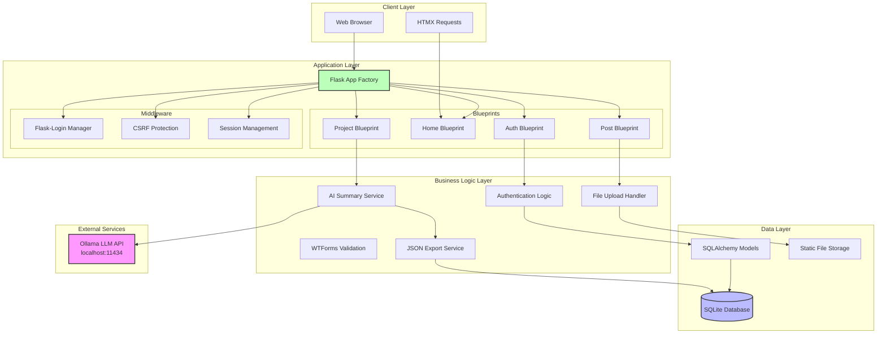
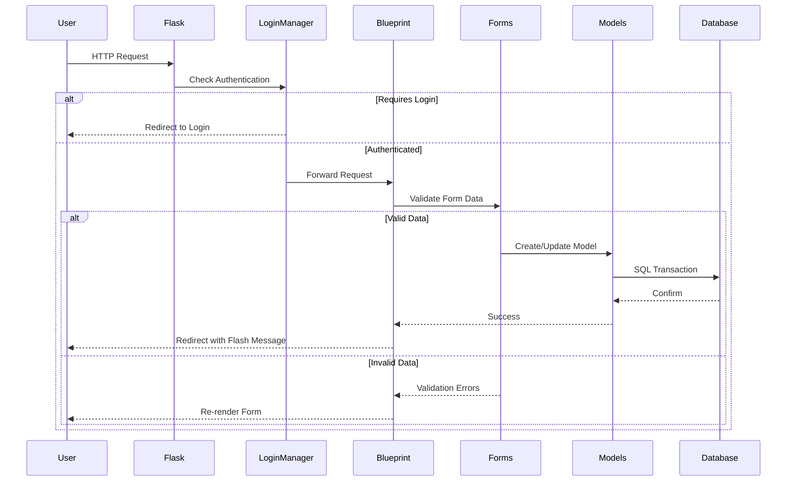
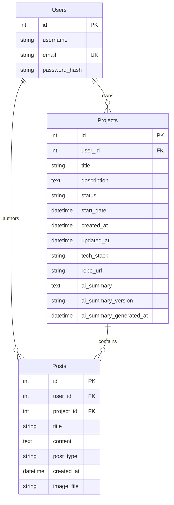
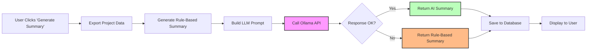

# OpenBuild - Build in Public Platform

<div align="center">

**A Flask-powered platform for developers to document their project journey, share updates, and build in public**

[](https://python.org)
[](https://flask.palletsprojects.com/)
[](https://www.sqlalchemy.org/)
[](LICENSE)

</div>

---

## 📋 Table of Contents

- [Architecture Overview](#-architecture-overview)
- [Tech Stack](#-tech-stack)
- [Database Schema](#-database-schema)
- [API Routes](#-api-routes)
- [Project Structure](#-project-structure)
- [Features](#-features)
- [Setup & Installation](#-setup--installation)
- [AI Integration](#-ai-integration)
- [Deployment](#-deployment)

---

## 🏗 Architecture Overview

OpenBuild follows a classic **MVC (Model-View-Controller)** pattern with Flask Blueprints for modular organization.



### Request Flow



---

## 🛠 Tech Stack

### Backend Framework

- **Flask 3.0.3** - Web framework
- **SQLAlchemy 3.1.1** - ORM for database operations
- **Flask-Migrate 4.0.7** - Database migrations (Alembic)
- **Flask-Login 0.6.3** - User session management
- **Flask-Bcrypt 1.0.1** - Password hashing
- **Flask-WTF 1.2.1** - Form handling and CSRF protection

### Frontend

- **Jinja2** - Server-side templating
- **HTMX** - Infinite scroll implementation
- **Vanilla CSS** - Custom styling (no frameworks)

### AI & Data Processing

- **Ollama** - Local LLM API (llama3.2 model)
- **Markdown 3.10** - Markdown rendering
- **Requests 2.31.0** - HTTP client for Ollama

### Media & File Handling

- **Pillow 10.4.0** - Image processing
- **MoviePy 1.0.3** - Video processing (future feature)

### Configuration

- **Python-dotenv 1.0.1** - Environment variable management

---

## 💾 Database Schema

OpenBuild uses **SQLite** with SQLAlchemy ORM. Below is the entity-relationship diagram:



### Relationships

1. **Users → Projects**: One-to-Many

   - A user can own multiple projects
   - Cascade delete: Deleting a user cascades to their projects

2. **Projects → Posts**: One-to-Many

   - A project contains multiple posts (updates)
   - Cascade delete: Deleting a project deletes all its posts

3. **Users → Posts**: One-to-Many
   - A user authors multiple posts
   - Foreign key reference for attribution

### Enums & Constants

**Project Status**:

- `ideation` → Idea phase
- `in_progress` → Active development
- `beta` → Testing phase
- `launched` → Production/Live

**Post Types**:

- `init` - Project initialization
- `update` - General progress update
- `feature` - New feature implementation
- `fix` - Bug fix
- `decision` - Architectural decision
- `learning` - Reflection and learning
- `milestone` - Major achievement

---

## 🛣 API Routes

### Authentication Routes (`/`)

| Method   | Endpoint    | Handler           | Auth Required | Description       |
| -------- | ----------- | ----------------- | ------------- | ----------------- |
| GET/POST | `/register` | `auth.register()` | ❌            | User registration |
| GET/POST | `/login`    | `auth.login()`    | ❌            | User login        |
| GET      | `/logout`   | `auth.logout()`   | ✅            | User logout       |

### Home Routes (`/`)

| Method | Endpoint   | Handler            | Auth Required | Description                   |
| ------ | ---------- | ------------------ | ------------- | ----------------------------- |
| GET    | `/`        | `home.view_home()` | ❌            | Landing page / Community feed |
| GET    | `/?page=N` | `home.view_home()` | ❌            | Paginated feed (HTMX)         |

### Project Routes (`/project`)

| Method   | Endpoint                            | Handler                               | Auth Required | Description           |
| -------- | ----------------------------------- | ------------------------------------- | ------------- | --------------------- |
| GET/POST | `/project/new`                      | `project.new_project()`               | ✅            | Create new project    |
| GET      | `/project`                          | `project.view_projects()`             | ✅            | List user's projects  |
| GET      | `/project/<id>`                     | `project.project_details()`           | ✅            | View project timeline |
| GET/POST | `/project/<id>/edit`                | `project.project_edit()`              | ✅            | Edit project metadata |
| POST     | `/project/<id>/delete`              | `project.project_delete()`            | ✅            | Delete project        |
| GET      | `/project/<id>/ai-summary`          | `project.ai_summary()`                | ✅            | View AI summary       |
| POST     | `/project/<id>/ai-summary/generate` | `project.ai_summary_generate_ready()` | ✅            | Generate AI summary   |

### Post Routes (`/post`)

| Method   | Endpoint                 | Handler              | Auth Required | Description        |
| -------- | ------------------------ | -------------------- | ------------- | ------------------ |
| GET/POST | `/project/<id>/post/new` | `post.post_new()`    | ✅            | Create new update  |
| GET/POST | `/post/<id>/edit`        | `post.post_edit()`   | ✅            | Edit existing post |
| POST     | `/post/<id>/delete`      | `post.post_delete()` | ✅            | Delete post        |

---

## 📁 Project Structure

```
openbuild/
│
├── app/                          # Main application package
│   ├── __init__.py              # Flask app factory
│   ├── models.py                # SQLAlchemy models
│   ├── form.py                  # WTForms definitions
│   ├── constants.py             # App-wide constants
│   │
│   ├── routes/                  # Blueprint modules
│   │   ├── auth.py             # Authentication routes
│   │   ├── home.py             # Home/feed routes
│   │   ├── project.py          # Project CRUD routes
│   │   └── post.py             # Post CRUD routes
│   │
│   ├── ai/                      # AI integration modules
│   │   ├── llm.py              # Ollama LLM client
│   │   ├── prompt.py           # Prompt templates
│   │   ├── summary.py          # AI summary generator
│   │   └── ai_summary_service.py  # Service orchestration
│   │
│   ├── static/                  # Static assets
│   │   ├── css/                # Stylesheets
│   │   └── uploads/            # User-uploaded images
│   │
│   └── templates/               # Jinja2 templates
│       ├── base.html           # Base layout
│       ├── home.html           # Landing page
│       ├── project_detail.html # Project timeline
│       ├── ai_summary.html     # AI summary display
│       └── partials/           # HTMX partials
│           └── _feed_items.html
│
├── migrations/                  # Alembic database migrations
│   └── versions/               # Migration scripts
│
├── exports/                     # JSON export storage
│   └── project_*.json          # Exported project data
│
├── instance/                    # Instance-specific files
│   └── app.db                  # SQLite database
│
├── export.py                   # Standalone export utility
├── run.py                      # Application entry point
├── requirements.txt            # Python dependencies
├── .env                        # Environment variables (gitignored)
└── README.md                   # This file
```

---

## ✨ Features

### Core Features

1. **User Authentication**

   - Secure registration with email uniqueness
   - Password hashing using Bcrypt
   - Session-based authentication via Flask-Login

2. **Project Management**

   - Create and manage multiple projects
   - Track project status (ideation → launched)
   - Store tech stack and repository links
   - Timeline-based visualization

3. **Build Log / Updates**

   - Categorized post types (feature, fix, milestone, etc.)
   - Markdown support for rich content
   - Image upload for visual documentation
   - Chronological timeline display

4. **Community Feed**

   - Infinite scroll with HTMX
   - Real-time updates from all users
   - Pagination with 5 posts per page

5. **AI-Powered Summaries**

   - Auto-generate project summaries using local LLM
   - Structured data export to JSON
   - Rule-based fallback if AI unavailable
   - Version tracking for summaries

6. **Data Export**
   - Export project data to structured JSON
   - Includes metadata, journey logs, and timestamps
   - Schema versioning (v1.2.0)

### Security Features

- ✅ CSRF protection on all forms
- ✅ Password hashing (Bcrypt)
- ✅ Authorization checks (user-owned resources only)
- ✅ SQL injection prevention (SQLAlchemy ORM)
- ✅ XSS protection in markdown rendering
- ✅ File upload validation (allowed extensions)

---

## 🚀 Setup & Installation

### Prerequisites

- Python 3.11+
- Ollama (for AI features)
- Git

### Step 1: Clone Repository

```bash
git clone https://github.com/nimish-23/openbuild.git
cd openbuild
```

### Step 2: Create Virtual Environment

```bash
python -m venv env
source env/Scripts/activate  # Windows
source env/bin/activate      # Linux/Mac
```

### Step 3: Install Dependencies

```bash
pip install -r requirements.txt
```

### Step 4: Configure Environment

Create a `.env` file in the root directory:

```env
SECRET_KEY=your-secret-key-here
DATABASE_URL=sqlite:///instance/app.db
```

Generate a secure secret key:

```bash
python -c "import secrets; print(secrets.token_hex(32))"
```

### Step 5: Initialize Database

```bash
flask db init      # First time only
flask db migrate -m "Initial migration"
flask db upgrade
```

### Step 6: Start Ollama (for AI features)

```bash
ollama serve
ollama pull llama3.2
```

### Step 7: Run Application

```bash
python run.py
```

Visit: `http://localhost:5000`

---

## 🤖 AI Integration

OpenBuild uses **Ollama** to run local LLMs for generating project summaries.

### Architecture



### Flow

1. **Data Export** - Project data exported to structured JSON
2. **Rule-Based Summary** - Fallback summary generated from data
3. **Prompt Engineering** - Structured prompt sent to LLM
4. **LLM Inference** - Ollama processes request (60s timeout)
5. **Validation** - Response validated (min 20 characters)
6. **Storage** - Summary saved to `projects.ai_summary`

### Configuration

- **API Endpoint**: `http://localhost:11434/api/generate`
- **Model**: `llama3.2`
- **Timeout**: 60 seconds
- **Fallback**: Rule-based summary on failure

---

## 🌐 Deployment

### Production Checklist

- [ ] Set `SECRET_KEY` to strong random value
- [ ] Use production database (PostgreSQL recommended)
- [ ] Set `FLASK_ENV=production`
- [ ] Configure reverse proxy (Nginx/Apache)
- [ ] Enable HTTPS
- [ ] Set up file upload limits
- [ ] Configure logging
- [ ] Set up database backups
- [ ] Deploy Ollama separately or use API service

### Recommended Stack

```
User → Nginx (Reverse Proxy) → Gunicorn → Flask App → PostgreSQL
                                                      → Ollama Service
                                                      → File Storage (S3/Local)
```

### Example Gunicorn Command

```bash
gunicorn -w 4 -b 0.0.0.0:8000 run:app
```

---

## 📝 API Data Formats

### Project Export JSON

```json
{
  "schema_version": "1.2.0",
  "enums": {
    "post_types": [
      "init",
      "update",
      "feature",
      "fix",
      "decision",
      "learning",
      "milestone"
    ]
  },
  "meta": {
    "id": 1,
    "title": "OpenBuild",
    "tech_stack": ["Python", "Flask", "SQLAlchemy"],
    "description": "Build in public platform",
    "status": "in_progress",
    "project_stage": "active_development",
    "repo_url": "https://github.com/example/repo",
    "start_date": "2026-01-01 00:00:00",
    "created_at": "2026-01-01 00:00:00",
    "updated_at": "2026-01-07 00:00:00"
  },
  "journey": {
    "total_steps": 5,
    "logs": [
      {
        "step": 1,
        "title": "Initial Setup",
        "content": "Set up Flask application...",
        "post_type": "init",
        "post_intent": "foundation",
        "created_at": "2026-01-01T10:00:00"
      }
    ]
  }
}
```

---

## 🤝 Contributing

1. Fork the repository
2. Create a feature branch (`git checkout -b feature/amazing-feature`)
3. Commit your changes (`git commit -m 'Add amazing feature'`)
4. Push to the branch (`git push origin feature/amazing-feature`)
5. Open a Pull Request

---

## 📄 License

This project is licensed under the MIT License - see the [LICENSE](LICENSE) file for details.

---

## 👨‍💻 Author

**Nimish**  
GitHub: [@nimish-23](https://github.com/nimish-23)

---

## 🙏 Acknowledgments

- Flask community for excellent documentation
- Ollama for local LLM inference
- All contributors and users

---

<div align="center">
Made with ❤️ for builders who build in public
</div>
